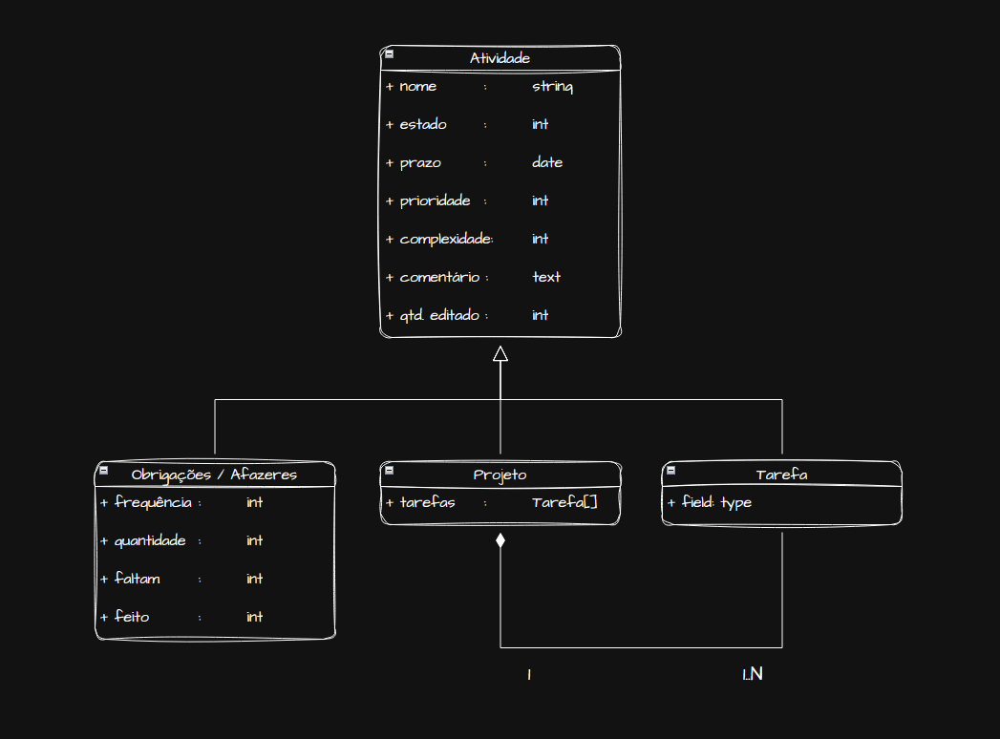
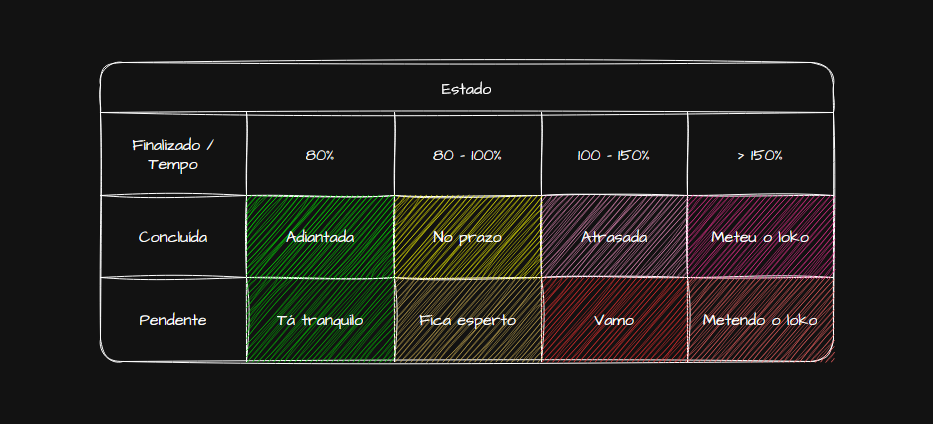
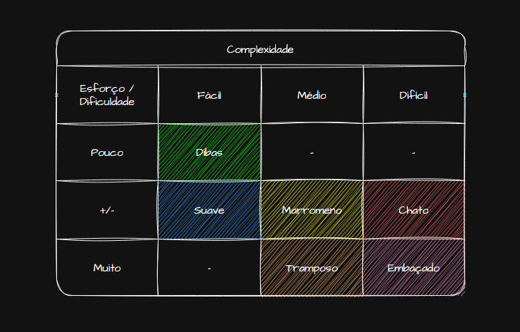
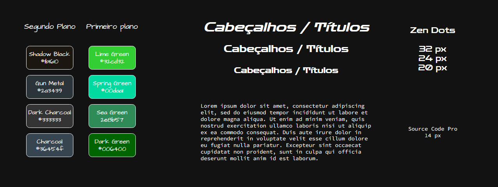

# Procrastinário - Uma Tentativa de Organização pessoal

## 1. Introdução
    
Nada mais clichê que um TODO, uma lista de afazeres, No entanto, o intuito não é esse.
Daí que vem o neologismo cunhado pela minha prepotência: procrastinário. Assim como o 
obituário que registra falecidos, prontuário que registram dados sobre o paciente, o
procrastinário registra sobre a sua procrastinação. Quanto tempo atrasei pra entregar
tal atividade, quanto tempo desprendi para os meus projetos pessoais, quanto tempo em
média eu atraso com as minhas obrigações. 

Assim, o intuito não é ajudar a pessoa a procrastinar menos, identificar onde ela está
falhando, qual tipo de atividade é mais negligenciada. O intuito não é ajudar ninguém,
o intuito é apenas retroalimentar puro suco do neuroticismo em categorizar a procrastinação. 

Tendo contado a historinha, o projeto baseia-se sobre uma aplicação na qual dados relativos
a atividades diárias sejam registrados e tais dados serem usados para inferir informações 
à cerca da rotina de um indíviduo.

Provavelmente já existe algo do tipo? Provavelmente - Mas... e daí, o que tem de diferente?
- Nada.

## 2. Objetivo

Coletar dados sobre atividades rotineiras para inferir informações a cerca à cerca da
rotina de um indíviduo.

## 3. Metodologia

[Ehhhhhh fishhhhtaile](https://www.youtube.com/watch?v=C-c4ref0yX8)

Como o projeto é relativamente simples, como não é trabalho também, não tem porque estipular
uma metodologia muito rígida. Assim, primeiramente o sistema será desenhado e então
serão divididas as atividades entre os integrantes do projeto, tendo que ser entregue
uma atividade por mês, não necessariamente uma funcionalidade. 

## 4. Requisitos

Os requisitos serão compreendidos em requisitos funcionais e não-funcionais. Os requisitos
não serão descritos em demasia, pois são relativamente simples e a integração entre tais
também não é complexa. 

### 4.1. Requisitos Funcionais

Os requisitos funcionais podem ser compreendidos como ações que são desempenhadas pelo
sistema ou usuário, assim, as ações realizáveis são:

#### 4.1.1. Gerenciar atividades

**Objetivo**: CRUD de atividades.

**Visualizações**: 

- Lista ordenada por prazo de atividades;
- Lista de obrigações;
- Lista de projetos com tarefas resumidas aninhadas;
- Modais / Dialog box para visualizar detalhes ou para criar atividades;

As atividades é o termo genérico para qualquer ação, tais ações podem ser compreendidas
dentro de 4 categorias: estrutura, estado, complexidade, prioridade. 

Quanto a **estrutura** da atividade há 3 tipos:

- Obrigações / Afazeres : atividades independentes, não correlacionadas entre si, 
normalmente associadas a atividades rotineiras ou atividades infrequentes (e.g. faxinar,
renovar cnh, etc.);
- Projetos : são conjuntos de atividades que devem ser concluídas para se atingir um
determinado objetivo (e.g. estudar algebra linear, desenvolver um sistema, pegar 300 
kg no agachamento, etc.)
- Tarefa : atividade relativa a um projeto (e.g. ler tal capítulo do livro e resenhar
sobre, desenhar telas do sistema, etc.)

Quanto ao **estado** há 6 tipos:

- Adiantada: atividade finalizada sobrando 20% do tempo entre a criação e 
prazo (delta para entrega);
- No prazo: atividade finalizada sobrando menos de 20% de delta para entrega;
- Atrasada: atividade finalizada após prazo de entrega não ultrapassando em 
50% a mais do delta de entrega (e.g. delta de 40 dias, até 60 dias);
- Meteu o loko: atividade finalizada com mais de 50% de atraso;
- Tá tranquilo: atividade não finalizada sobrando 20% do delta;
- Fica esperto: atividade não finalizada sobrando menos de 20% de 
delta para a entrega;
- Vamo: atividade não finalizada dentro do prazo;
- Metendo o loko: atividade não finalizada nem com 50% de atraso;

Quanto a **complexidade** há 6 tipos:

- Dibas: não demanda nem tempo nem esforço, fácil;
- Suave: demanda pouco tempo e pouco esforço, fácil;
- Marromeno: demanda algum tempo ou algum esforço, médio;
- Tramposo: demanda tempo e esforço, médio;
- Chato: demanda tempo e esforço, difícil;
- Embaçado: demanda tempo e esfor, difícil

Quanto a **prioridade** há 5 tipos:

- Não importa
- Baixa
- Média
- Alta
- Urgente

#### 4.1.2. Gerar relatório de atividades 

**Objetivo**: Análise de atividades.

**Visualizações**: 

- [gráfico de linha];
- [gráfico de barras verticais];
- [gráfico de barras horizontais];

#### 4.1.3. Situação atual

**Objetivo**: Alertar usuário sobre prazos e estado de atividades.

**Visualizações**: 

- Destacar estado na lista de pendências;
- Alterar tela de fundo conforme a situação em relação aos prazos (mensurar pela prioridade
e prazos);
- Percentual de atividades concluídas do mês;

Na lista de pendências atividades concluídas aparecem como ~~riscadas~~, atividades
atrasadas são destacadas em vermelho, atividades não finalizadas dentro do prazo são
exibidas sem destaque.

Para a tela de fundo haverá uma pontuação de acordo com o estado das atividades pendentes,
assim, há quatro estados possíveis.

- Tá de boa;
- Fica esperto;
- Não tá de boa;
- Vacilando;

#### 4.1.4. Relatar dia

**Objetivo**: Tecer comentário sobre o dia e sobre as atividades realizadas no dado dia 
(CRUD de comentários).

**Visualizações**: 

- Quadro para exibir comentários;
- Modal / Dialog box para inserção de novos comentários;
- Visualizar comentários passados;

### 4.2. Requisitos Não-Funcionais

Enquanto os requisitos funcionais se aproximam conceitualmente de ações, os requisitos
não-funcionais se aproximam de características de sistema.

- Aplicação deverá ser local;
- Banco de dados embutido na aplicação;
- Evitar dependências (fazer o máximo possível na unha);

## 5. Design

O projeto pode ser modelado segundo o que se deseja visualizar. Caso se objetiva visualizar
como o projeto será estruturado e se comporta será entendido como modelagem de sistema.
Caso se objetiva visualizar como o será apresentado o sistema pode-se compreender como
modelagem gráfica.

## 5.1. Sistema

### 5.1.1. Arquitetura

### 5.1.2. Comportamento

### 5.1.3. Modelo Entidade-Relacionamento

## 5.2. Gráfica

A ideia é que cada integrante do projeto elabore um tema diferente. Para tal, cada qual
definirá as referências visuais, paleta de cores e fontes. Porém, o método de composição
das telas será o mesmo, o qual consiste em decompor a tela em elementos modulares, 
"atomizando" a tela, reduzindo-a aos seus elementos indivisíveis.

### 5.2.1. Referências visuais

As referências visuais não são necessariamente uma imposição sobre como os elementos 
são compostos, é apenas um direcionamento.

*TEMA 1: Ecobrutalista (SAKA)*
> Mesmo o ecobrutalismo sendo um paradoxo (tendo em vista que o cimento é responsável 
> por boa parte da emissão de CO2 na atmosfera, contribuindo significamente para o aumento
> da temperatura da atmosfera), esteticamente é muito interessante, pois apresenta um 
> um contraste muito interessante entre natureza com o verde das plantas e o urbano /
> industrial com o cinza do cimento.

### 5.2.2. Paleta de cores e fontes

*TEMA 1: ecobrutalismo*

### 5.2.3. Decomposição de telas

Genericamente, a tela pode ser decomposta em 3 elementos:

- Cartões: elementos que contém informações / dados;
- Quadros: elementos que contém cartões;
- Campos de entrada: elementos usados nos formulários para inserção de dados;

#### 5.2.3.1. Cartões

*Projeto*

*Tarefa*

*Obrigação / Afazer*

*Pendência*

*Relato*

*Gráfico de barra*

*Gráfico de linha*

#### 5.2.3.2. Quadros

*Lista de pendências*

*Lista de relatos diários*

*Lista de afazeres*

*Lista de projetos*

*Lista de relatos arquivados*

*Painel gráficos e análises*

*Quadro de integrantes*

#### 5.2.3.2. Campos de entrada

*texto*

*data*

*botão ---*

*comentário*

*seleção*

### 5.2.4. Composição de telas

A tela é composta através da junção e dos elementos abstraídos na decomposição da tela.

#### 5.2.3.1. Atividades

Tela principal na qual o usuário gerencia as suas atividades.

#### 5.2.3.2. Projetos

Tela para que o usuário possa visualizar seus projetos.

#### 5.2.3.3. Relatos

Tela para que o usuário acesse os relatos diários arquivados. 

#### 5.2.3.4. Relatório

Painel no qual é exibido o relatório de atividades, análises e afins. 

#### 5.2.3.5. Sobre nós

Tela sobre os integrantes do projeto.

